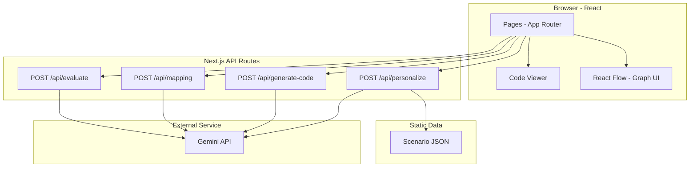
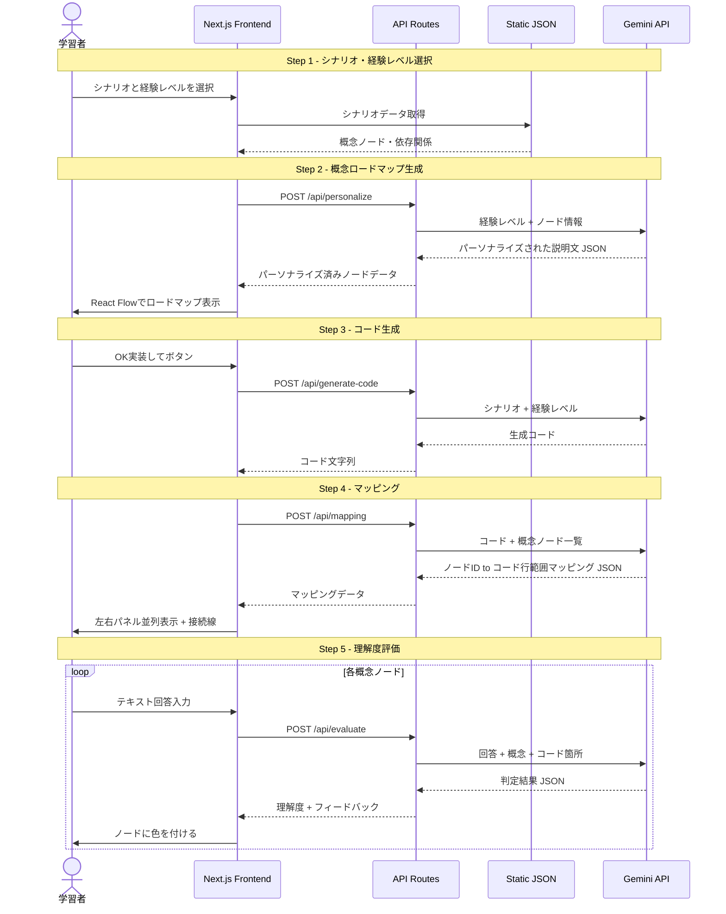
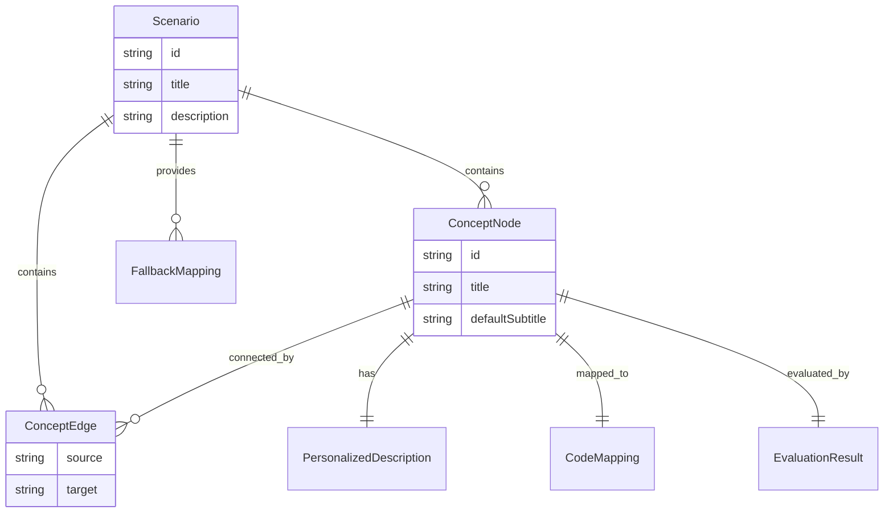

# Design Document — riasapo-learning-support

## Overview

**Purpose**: リアサポは、AI時代の学習者が「AIにコードを書かせる前に、何を理解すべきか」を把握するための概念ロードマップを提供し、コード生成後に理解度を自己評価する体験を届ける。

**Users**: プログラミング初学者〜中級者が、シナリオ選択→ロードマップ確認→コード生成→マッピング確認→理解度評価の5ステップを通じて利用する。

**Impact**: 新規Webアプリケーションとして構築。既存システムへの変更なし。

### Goals
- Todoアプリシナリオで5ステップの体験フローを一気通貫で動かす
- Gemini APIを全ステップで活用し、パーソナライズ・コード生成・マッピング・判定のパイプラインを実現する
- 審査デモとして安定動作するプロトタイプを構築する

### Non-Goals
- MCPサーバー対応（将来構想）
- モバイル対応
- ユーザー認証・データ永続化
- 複数シナリオの動的追加機能
- 学習履歴の保存・分析

## Architecture

### Architecture Pattern & Boundary Map



**Architecture Integration**:
- **Selected pattern**: Next.js App Router一体型。フロント・バック・APIを1プロジェクトに集約（詳細は`research.md`参照）
- **Domain boundaries**: UI層（Pages + Components）/ API層（Route Handlers）/ Data層（Static JSON）/ External（Gemini API）
- **New components rationale**: 各APIエンドポイントはGemini APIの呼び出しパターンが異なるため個別に定義
- **Steering compliance**: N/A（steeringなし）

### Technology Stack

| Layer | Choice / Version | Role in Feature | Notes |
|-------|------------------|-----------------|-------|
| Frontend | React 19 + Next.js 15 (App Router) | ページ遷移、UI描画、ステート管理 | |
| Graph UI | React Flow v12 | 概念ロードマップの描画、ノードインタラクション | dagre自動レイアウト |
| Code Display | react-syntax-highlighter | コードのシンタックスハイライト表示 | 行範囲ハイライト対応 |
| Backend | Next.js Route Handlers | Gemini API呼び出しのプロキシ、APIキー保護 | `app/api/*/route.ts` |
| AI | Gemini 2.5 Flash (API) | パーソナライズ、コード生成、マッピング、判定 | 構造化出力モード使用 |
| Data | Static JSON files | シナリオ定義、概念ノード、フォールバック値 | `src/data/*.json` |
| Infrastructure | Cloud Run | Next.js standaloneビルドのコンテナデプロイ | Docker |
| Styling | Tailwind CSS v4 | ユーティリティファーストCSS | |

## System Flows

### メイン体験フロー（Step 1〜5）



**Key Decisions**:
- 各ステップのGemini API呼び出しは独立したAPIエンドポイントで処理（関心の分離）
- Step 3のコード生成のみストリーミングを検討（レスポンスが長い）。他はJSON構造化出力で一括返却
- フォールバックはAPI層で処理し、フロントには常に有効なデータを返す

## Requirements Traceability

| Requirement | Summary | Components | Interfaces | Flows |
|-------------|---------|------------|------------|-------|
| 1.1〜1.6 | シナリオ・経験レベル選択 | ScenarioSelectPage, ScenarioCard, LevelSelector | — | Step 1 |
| 2.1〜2.8 | 概念ロードマップ生成・表示 | RoadmapPage, ConceptNode, RoadmapGraph | POST /api/personalize | Step 2 |
| 3.1〜3.5 | コード生成 | GeneratingPage | POST /api/generate-code | Step 3 |
| 4.1〜4.8 | 概念↔コードマッピング表示 | MappingPage, CodePanel, ConnectionLines | POST /api/mapping | Step 4 |
| 5.1〜5.9 | 理解度評価 | EvaluationPage, AnswerPanel, NodeColorManager | POST /api/evaluate | Step 5 |
| 6.1〜6.4 | 画面共通UI | AppLayout, StepIndicator, Header | — | 全Step |
| 7.1〜7.5 | Gemini API統合 | GeminiClient, API Route Handlers | 全APIエンドポイント | 全Step |
| 8.1〜8.4 | シナリオデータ管理 | ScenarioDataLoader | — | Step 1〜4 |

## Components and Interfaces

| Component | Domain/Layer | Intent | Req Coverage | Key Dependencies | Contracts |
|-----------|-------------|--------|--------------|-----------------|-----------|
| AppLayout | UI/Layout | ステップインジケーター付き共通レイアウト | 6.1〜6.4 | — | State |
| ScenarioSelectPage | UI/Page | Step 1のシナリオ・レベル選択画面 | 1.1〜1.6 | ScenarioDataLoader (P0) | State |
| RoadmapPage | UI/Page | Step 2のロードマップ表示画面 | 2.1〜2.8 | RoadmapGraph (P0), PersonalizeAPI (P0) | State |
| GeneratingPage | UI/Page | Step 3のローディング画面 | 3.1〜3.5 | GenerateCodeAPI (P0) | State |
| MappingPage | UI/Page | Step 4の並列表示画面 | 4.1〜4.8 | CodePanel (P0), RoadmapGraph (P0), MappingAPI (P0) | State |
| EvaluationPage | UI/Page | Step 5の理解度評価画面 | 5.1〜5.9 | AnswerPanel (P0), EvaluateAPI (P0) | State |
| RoadmapGraph | UI/Component | React Flowベースの概念グラフ描画 | 2.3〜2.6, 4.4〜4.6 | React Flow (P0), dagre (P1) | State |
| ConceptNode | UI/Component | カスタムReact Flowノード | 2.4, 2.6, 5.4 | — | — |
| CodePanel | UI/Component | シンタックスハイライト付きコード表示 | 4.2, 4.5〜4.6 | react-syntax-highlighter (P0) | — |
| ScenarioDataLoader | Data/Utility | 静的JSONからシナリオデータ取得 | 8.1〜8.4 | — | Service |
| GeminiClient | API/Service | Gemini APIとの通信クライアント | 7.1〜7.5 | Gemini API (P0) | Service |

### UI Layer

#### AppLayout

| Field | Detail |
|-------|--------|
| Intent | 全ステップ共通のヘッダー・ステップインジケーター・コンテンツ領域を提供する |
| Requirements | 6.1, 6.2, 6.3, 6.4 |

**Responsibilities & Constraints**
- ヘッダーにアプリ名「リアサポ」を常時表示
- ステップインジケーター（1→2→3→4→5）で現在のステップを強調
- デスクトップ画面に最適化されたレイアウト

**Contracts**: State [x]

##### State Management
- State model: `currentStep: 1 | 2 | 3 | 4 | 5`
- Persistence: URLパス（`/step/1`, `/step/2`, ...）と同期

#### RoadmapGraph

| Field | Detail |
|-------|--------|
| Intent | React Flowで概念ノードと依存関係を描画し、インタラクション（ホバー・クリック）を処理する |
| Requirements | 2.3, 2.4, 2.5, 2.6, 4.4, 4.5, 4.6, 5.4 |

**Responsibilities & Constraints**
- ConceptNodeをカスタムノードとして登録し描画
- dagre自動レイアウトでノードを上→下に配置
- ノードの色状態（グレー/🟢/🟡/🔴）をpropsで受け取り反映
- Step 4ではホバー・クリック時にコールバックを発火

**Dependencies**
- External: React Flow v12 — グラフ描画エンジン (P0)
- External: dagre — 自動レイアウト計算 (P1)

**Contracts**: State [x]

##### State Management
- State model:

```typescript
interface RoadmapGraphProps {
  nodes: ConceptNodeData[];
  edges: ConceptEdge[];
  onNodeHover?: (nodeId: string | null) => void;
  onNodeClick?: (nodeId: string) => void;
}

interface ConceptNodeData {
  id: string;
  title: string;
  subtitle: string;
  codeSnippet?: string;
  status: 'default' | 'green' | 'yellow' | 'red';
}

interface ConceptEdge {
  source: string;
  target: string;
}
```

#### ConceptNode

| Field | Detail |
|-------|--------|
| Intent | 概念ノードのカスタム表示（タイトル + サブテキスト + コード例 + 色状態） |
| Requirements | 2.4, 2.6, 5.4 |

**Implementation Notes**
- React Flowのカスタムノードとして実装
- statusに応じてボーダー色を変更（default→gray, green→#4CAF50, yellow→#FFC107, red→#F44336）
- codeSnippetが存在する場合のみコード行を表示（Step 4以降）

#### CodePanel

| Field | Detail |
|-------|--------|
| Intent | 生成コードをシンタックスハイライト付きで表示し、指定行範囲をハイライトする |
| Requirements | 4.2, 4.5, 4.6 |

**Dependencies**
- External: react-syntax-highlighter — シンタックスハイライト (P0)

**Contracts**: State [x]

##### State Management
```typescript
interface CodePanelProps {
  code: string;
  language: string;
  highlightRanges: HighlightRange[];
  activeRange?: HighlightRange;
}

interface HighlightRange {
  nodeId: string;
  startLine: number;
  endLine: number;
  color: string;
}
```

### API Layer

#### GeminiClient

| Field | Detail |
|-------|--------|
| Intent | Gemini APIとの通信を一元管理し、構造化出力・エラーハンドリング・リトライを提供する |
| Requirements | 7.1, 7.2, 7.3, 7.4, 7.5 |

**Responsibilities & Constraints**
- Gemini APIキーを環境変数（`GEMINI_API_KEY`）から取得
- 構造化出力モード（`response_mime_type: "application/json"` + `response_schema`）を使用
- APIエラー時のリトライ（最大2回）
- レスポンスのJSON parse失敗時にフォールバック値を返す

**Dependencies**
- External: Gemini API — AI推論サービス (P0)

**Contracts**: Service [x]

##### Service Interface
```typescript
interface GeminiClient {
  personalizeDescriptions(
    nodes: ConceptNodeData[],
    experienceLevel: ExperienceLevel
  ): Promise<Result<PersonalizedNode[], GeminiError>>;

  generateCode(
    scenario: ScenarioDefinition,
    experienceLevel: ExperienceLevel
  ): Promise<Result<GeneratedCode, GeminiError>>;

  mapConceptsToCode(
    nodes: ConceptNodeData[],
    code: string
  ): Promise<Result<ConceptCodeMapping[], GeminiError>>;

  evaluateUnderstanding(
    node: ConceptNodeData,
    codeSnippet: string,
    userAnswer: string
  ): Promise<Result<EvaluationResult, GeminiError>>;
}
```

#### API Route: POST /api/personalize

| Field | Detail |
|-------|--------|
| Intent | 経験レベルに基づいて概念ノードの説明文をパーソナライズする |
| Requirements | 2.2, 2.8 |

**Contracts**: API [x]

##### API Contract
| Method | Endpoint | Request | Response | Errors |
|--------|----------|---------|----------|--------|
| POST | /api/personalize | PersonalizeRequest | PersonalizeResponse | 400, 500 |

```typescript
interface PersonalizeRequest {
  scenarioId: string;
  experienceLevel: ExperienceLevel;
}

interface PersonalizeResponse {
  nodes: PersonalizedNode[];
}

interface PersonalizedNode {
  id: string;
  title: string;
  subtitle: string;
}
```

#### API Route: POST /api/generate-code

| Field | Detail |
|-------|--------|
| Intent | シナリオに基づいてGemini APIでコードを生成する |
| Requirements | 3.1, 3.5 |

**Contracts**: API [x]

##### API Contract
| Method | Endpoint | Request | Response | Errors |
|--------|----------|---------|----------|--------|
| POST | /api/generate-code | GenerateCodeRequest | GenerateCodeResponse | 400, 500 |

```typescript
interface GenerateCodeRequest {
  scenarioId: string;
  experienceLevel: ExperienceLevel;
}

interface GenerateCodeResponse {
  code: string;
  language: string;
  filename: string;
}
```

#### API Route: POST /api/mapping

| Field | Detail |
|-------|--------|
| Intent | 生成コードと概念ノードの対応関係を判定する |
| Requirements | 4.1, 4.8 |

**Contracts**: API [x]

##### API Contract
| Method | Endpoint | Request | Response | Errors |
|--------|----------|---------|----------|--------|
| POST | /api/mapping | MappingRequest | MappingResponse | 400, 500 |

```typescript
interface MappingRequest {
  scenarioId: string;
  code: string;
  nodes: { id: string; title: string }[];
}

interface MappingResponse {
  mappings: ConceptCodeMapping[];
}

interface ConceptCodeMapping {
  nodeId: string;
  codeSnippet: string;
  startLine: number;
  endLine: number;
  explanation: string;
}
```

#### API Route: POST /api/evaluate

| Field | Detail |
|-------|--------|
| Intent | 学習者のテキスト回答を判定し、理解度と フィードバックを返す |
| Requirements | 5.3, 5.4, 5.5, 5.9 |

**Contracts**: API [x]

##### API Contract
| Method | Endpoint | Request | Response | Errors |
|--------|----------|---------|----------|--------|
| POST | /api/evaluate | EvaluateRequest | EvaluateResponse | 400, 500 |

```typescript
interface EvaluateRequest {
  nodeId: string;
  nodeTitle: string;
  codeSnippet: string;
  userAnswer: string;
  experienceLevel: ExperienceLevel;
}

interface EvaluateResponse {
  nodeId: string;
  status: 'green' | 'yellow' | 'red';
  feedback: string;
}
```

### Data Layer

#### ScenarioDataLoader

| Field | Detail |
|-------|--------|
| Intent | 静的JSONファイルからシナリオ定義・概念ノード・フォールバックデータを読み込む |
| Requirements | 8.1, 8.2, 8.3, 8.4 |

**Contracts**: Service [x]

##### Service Interface
```typescript
interface ScenarioDataLoader {
  getScenarioList(): ScenarioSummary[];
  getScenario(scenarioId: string): ScenarioDefinition;
  getExperienceLevels(): ExperienceLevel[];
}

interface ScenarioSummary {
  id: string;
  title: string;
  description: string;
  available: boolean;
}

interface ScenarioDefinition {
  id: string;
  title: string;
  description: string;
  nodes: ConceptNodeDefinition[];
  edges: ConceptEdge[];
  fallbackMappings: FallbackMapping[];
}

interface ConceptNodeDefinition {
  id: string;
  title: string;
  defaultSubtitle: string;
  dependsOn: string[];
}

interface FallbackMapping {
  nodeId: string;
  codeExample: string;
  explanation: string;
}

type ExperienceLevel = 'complete-beginner' | 'python-experienced' | 'other-language-experienced';
```

## Data Models

### Domain Model



- **Aggregate Root**: Scenario（シナリオが全てのノード・エッジを所有）
- **Value Objects**: ConceptEdge, PersonalizedDescription, CodeMapping, EvaluationResult
- **Invariants**: ノードIDはシナリオ内でユニーク。エッジのsource/targetは既存ノードIDを参照

### Logical Data Model

リアサポはDBを使用しない。全データは以下の形態で管理：

- **Static JSON** (`src/data/scenarios/*.json`): シナリオ定義。ビルド時に読み込み
- **Runtime State** (React State / URL): ユーザーの選択、生成コード、マッピング結果、評価結果。セッション内のみ保持
- **Environment Variables**: `GEMINI_API_KEY`

## Error Handling

### Error Strategy
Gemini API依存のプロダクトのため、API障害時のフォールバックを重視する。

### Error Categories and Responses

**User Errors (4xx)**:
- 未選択状態で次ステップへ遷移 → UIレベルでバリデーション（ボタン無効化）
- 空のテキスト回答 → 「回答を入力してください」のインラインバリデーション

**External Service Errors (Gemini API)**:
- パーソナライズ失敗 → 静的JSONのデフォルト説明文をフォールバック表示
- コード生成失敗 → エラーメッセージ + リトライボタン
- マッピング失敗 → 静的JSONのフォールバックマッピングを使用
- 判定失敗 → エラーメッセージ + リトライボタン

**System Errors (5xx)**:
- API Route内部エラー → 500レスポンス + クライアントでエラートースト表示

## Testing Strategy

### Unit Tests
- ScenarioDataLoader: JSON読み込み、バリデーション、存在しないIDの処理
- GeminiClient: 構造化出力のparse、エラーハンドリング、フォールバック
- ConceptNode: ステータスに応じた色表示、codeSnippet有無の表示切替

### Integration Tests
- API Routes: 各エンドポイントのリクエスト→レスポンス検証（Gemini APIモック使用）
- Step遷移: 各ステップ間のデータ受け渡し

### E2E Tests
- Happy Path: Step 1→5を通しで実行し、全ノードに色が付くことを確認
- フォールバック: Gemini API障害時にデフォルト値で体験が継続することを確認

## Security Considerations

- Gemini APIキーはサーバーサイド（環境変数）のみで使用。クライアントへの露出を防止
- API Routesでリクエストボディのバリデーション（不正なscenarioId、過長テキスト）
- Gemini APIへの送信テキストのサニタイズ（プロンプトインジェクション対策）
