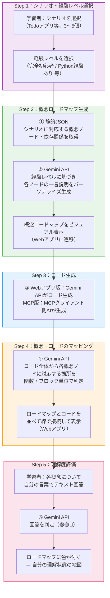

# 技術パイプライン図

```mermaid
flowchart TD
    subgraph Step1["Step 1：シナリオ・経験レベル選択"]
        A["学習者：シナリオを選択\n（Todoアプリ等、3〜5個）"] --> A2["経験レベルを選択\n（完全初心者 / Python経験あり 等）"]
    end

    subgraph Step2["Step 2：概念ロードマップ生成"]
        A2 --> B["① 静的JSON\nシナリオに対応する概念ノード・依存関係を取得"]
        B --> C["② Gemini API\n経験レベルに基づき\n各ノードの一言説明をパーソナライズ生成"]
        C --> D["概念ロードマップをビジュアル表示\n（Webアプリに遷移）"]
    end

    subgraph Step3["Step 3：コード生成"]
        D --> E["③ Webアプリ版：Gemini APIがコード生成\nMCP版：MCPクライアント側AIが生成"]
    end

    subgraph Step4["Step 4：概念↔コードのマッピング"]
        E --> G["④ Gemini API\nコード全体から各概念ノードに対応する箇所を\n関数・ブロック単位で判定"]
        G --> H["ロードマップとコードを\n並べて線で接続して表示\n（Webアプリ）"]
    end

    subgraph Step5["Step 5：理解度評価"]
        H --> I["学習者：各概念について\n自分の言葉でテキスト回答"]
        I --> J["⑤ Gemini API\n回答を判定（🟢🟡🔴）"]
        J --> K["ロードマップに色が付く\n＝ 自分の理解状態の地図"]
    end

    style Step1 fill:#F3E5F5,stroke:#9C27B0
    style Step2 fill:#E8F5E9,stroke:#4CAF50
    style Step3 fill:#E3F2FD,stroke:#2196F3
    style Step4 fill:#FFF3E0,stroke:#FF9800
    style Step5 fill:#FCE4EC,stroke:#E91E63
```
