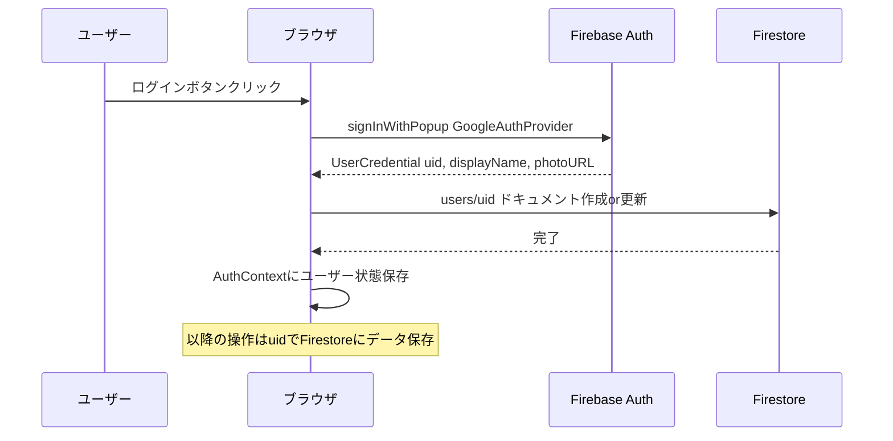
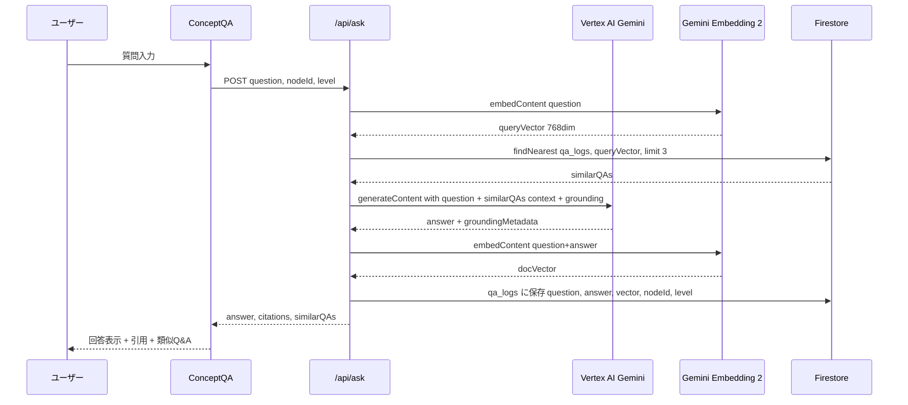
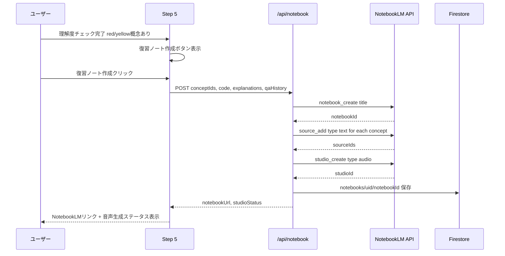
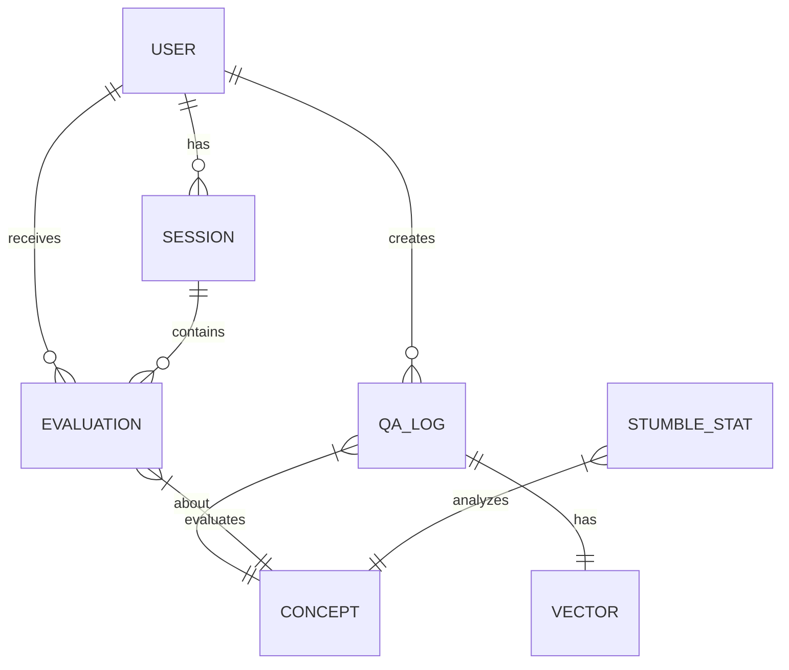
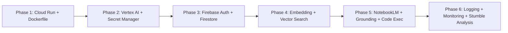

# Design Document: GCP全面移行

## Overview

**Purpose**: リアサポをGoogle Cloud Platform上で完全動作させ、データ永続化・AI機能強化・ベクトル検索・NotebookLM連携を実現する。

**Users**: プログラミング学習者（学習進捗の保存・高度なAI支援）、開発者（デプロイ・監視・運用）。

**Impact**: 現行のローカル実行・SessionStorage・APIキー直叩き構成を、GCPネイティブ構成に全面移行する。既存の`GeminiClient`インターフェースをAdapter Patternで差し替え、UIコンポーネントの変更を最小化する。

### Goals
- Cloud Run上でNext.jsアプリを本番稼働させる
- Vertex AI（`@google/genai` SDK）経由でGemini全機能を活用する
- Firebase Auth + Firestoreでユーザー管理・データ永続化を実現する
- Firestoreベクトル検索でQ&A類似検索を実現する
- NotebookLM連携で復習支援機能を提供する

### Non-Goals
- モバイルアプリ対応
- マルチテナント・管理者ダッシュボード
- BigQuery連携（将来フェーズ）
- Looker Studio連携（将来フェーズ）
- リアルタイム音声対話（Live API）

## Architecture

### Existing Architecture Analysis

現行アーキテクチャの特徴:
- **Clean Abstraction**: `GeminiClient`インターフェースがAPI呼び出しを完全に抽象化 → 実装差し替えのみで移行可能
- **SessionStorage依存**: Step間のデータ受け渡しが3つのsessionStorageキーに依存
- **認証なし**: 全ユーザーが匿名アクセス
- **ステートレスAPI**: 5つのAPIルートが全て独立、サーバーサイド状態なし

維持すべきパターン:
- `Result<T, GeminiError>` 判別共用体による型安全なエラーハンドリング
- 不変データパターン（readonly型）
- フォールバックシステム（API失敗時のデモデータ利用）

### Architecture Pattern and Boundary Map

```mermaid
graph TB
    subgraph Client[クライアント層]
        Browser[ブラウザ]
        FirebaseAuthSDK[Firebase Auth SDK]
        FirestoreClientSDK[Firestore Client SDK]
    end

    subgraph CloudRun[Cloud Run]
        NextJS[Next.js App]
        APIRoutes[API Routes]
        GenAIClient[GenAI Client]
        FirestoreAdmin[Firestore Admin SDK]
        NotebookLMClient[NotebookLM Client]
        Logger[Structured Logger]
    end

    subgraph GCPServices[GCPサービス]
        VertexAI[Vertex AI Gemini]
        Embedding[Gemini Embedding 2]
        Grounding[Google Search Grounding]
        CodeExec[Code Execution]
        Firestore[(Firestore DB)]
        SecretMgr[Secret Manager]
        CloudLog[Cloud Logging]
        CloudMon[Cloud Monitoring]
    end

    subgraph External[外部サービス]
        NotebookLM[NotebookLM API]
        FirebaseAuth[Firebase Auth Service]
    end

    Browser --> NextJS
    Browser --> FirebaseAuthSDK
    Browser --> FirestoreClientSDK
    FirebaseAuthSDK --> FirebaseAuth
    FirestoreClientSDK --> Firestore

    APIRoutes --> GenAIClient
    APIRoutes --> FirestoreAdmin
    APIRoutes --> NotebookLMClient
    APIRoutes --> Logger

    GenAIClient --> VertexAI
    GenAIClient --> Embedding
    GenAIClient --> Grounding
    GenAIClient --> CodeExec
    FirestoreAdmin --> Firestore
    NotebookLMClient --> NotebookLM

    NextJS --> SecretMgr
    Logger --> CloudLog
    Logger --> CloudMon
```



**Architecture Integration**:
- **Selected pattern**: Adapter Pattern — `GeminiClient`インターフェースを維持し、内部実装をVertex AI SDKに差し替え
- **Domain boundaries**: クライアント層（認証・リアルタイム同期）、APIサーバー層（AI処理・永続化）、GCPサービス層（外部API）
- **Existing patterns preserved**: Result型、フォールバック、不変データ、指数バックオフリトライ
- **New components rationale**: FirestoreAdmin（データ永続化）、NotebookLMClient（復習支援）、Logger（運用監視）

### Technology Stack

| Layer | Choice / Version | Role in Feature | Notes |
|-------|------------------|-----------------|-------|
| Frontend | Next.js 16.1.6 / React 19.2.3 | UI・ルーティング・SSR | 変更なし |
| Auth | Firebase Auth + firebase 11.x | Googleログイン・匿名モード | 新規追加 |
| AI SDK | @google/genai 1.45.0+ | Vertex AI Gemini呼び出し | @google-cloud/vertexai非推奨のため |
| Data | Firestore + firebase-admin 13.x | 永続化・ベクトル検索 | 新規追加 |
| Secrets | @google-cloud/secret-manager 5.x | シークレット管理 | Cloud Run環境用 |
| Logging | @google-cloud/logging 11.x | 構造化ログ | Cloud Run自動統合も併用 |
| NotebookLM | MCP経由 or REST API | 復習教材生成 | research.md参照 |
| Infrastructure | Cloud Run / Docker | コンテナデプロイ | standalone出力 |

## System Flows

### 認証フロー



### Q&Aベクトル検索フロー



### NotebookLM復習フロー



## Requirements Traceability

| Requirement | Summary | Components | Interfaces | Flows |
|-------------|---------|------------|------------|-------|
| 1.1-1.6 | Cloud Runデプロイ | Dockerfile, next.config.ts | — | — |
| 2.1-2.6 | Vertex AI移行 | GenAIClient | GeminiClient | — |
| 3.1-3.5 | Secret Manager | SecretManagerService | SecretProvider | — |
| 4.1-4.6 | Firebase Auth | AuthProvider, AuthContext | AuthService | 認証フロー |
| 5.1-5.6 | Firestore永続化 | FirestoreService, SessionSyncProvider | DataPersistence | — |
| 6.1-6.6 | Q&Aベクトル検索 | EmbeddingService, VectorSearchService | EmbeddingClient | Q&Aベクトル検索フロー |
| 7.1-7.4 | つまずきパターン分析 | StumbleAnalyzer | AnalyticsService | — |
| 8.1-8.5 | NotebookLM連携 | NotebookLMClient | NotebookService | NotebookLM復習フロー |
| 9.1-9.5 | Logging/Monitoring | StructuredLogger | LoggerService | — |
| 10.1-10.4 | Grounding | GenAIClient拡張 | GroundingResult | Q&Aベクトル検索フロー |
| 11.1-11.5 | Code Execution | GenAIClient拡張 | CodeExecutionResult | — |

## Components and Interfaces

| Component | Domain/Layer | Intent | Req Coverage | Key Dependencies | Contracts |
|-----------|-------------|--------|--------------|-----------------|-----------|
| GenAIClient | AI/Server | Vertex AI Gemini呼び出し | 2, 10, 11 | @google/genai (P0) | Service |
| EmbeddingService | AI/Server | テキストベクトル化 | 6 | @google/genai (P0) | Service |
| FirestoreService | Data/Server | データ永続化・ベクトル検索 | 5, 6, 7 | firebase-admin (P0) | Service |
| AuthProvider | Auth/Client | Firebase認証UI・状態管理 | 4 | firebase/auth (P0) | State |
| SessionSyncProvider | Data/Client | SessionStorage-Firestore同期 | 5 | FirestoreService (P0), AuthProvider (P1) | State |
| NotebookLMClient | AI/Server | NotebookLM API呼び出し | 8 | NotebookLM MCP (P0) | Service |
| StructuredLogger | Infra/Server | 構造化ログ出力 | 9 | Cloud Logging (P1) | Service |
| SecretManagerService | Infra/Server | シークレット取得 | 3 | @google-cloud/secret-manager (P0) | Service |
| StumbleAnalyzer | Analytics/Server | つまずきパターン集計 | 7 | FirestoreService (P0) | Service |

### AI/Server Layer

#### GenAIClient

| Field | Detail |
|-------|--------|
| Intent | Vertex AI Gemini呼び出しの統一クライアント（Grounding・Code Execution含む） |
| Requirements | 2.1-2.6, 10.1-10.4, 11.1-11.5 |

**Responsibilities and Constraints**
- 既存の`GeminiClient`インターフェースを完全に維持する（Adapter Pattern）
- `@google/genai` SDKでVertex AIバックエンドを使用
- Cloud RunのADCで認証（APIキー不要）
- Grounding・Code Executionはオプショナルツールとして注入

**Dependencies**
- External: `@google/genai` — Gemini API呼び出し (P0)
- External: Vertex AI — AI処理基盤 (P0)
- Outbound: StructuredLogger — API呼び出しログ記録 (P1)

**Contracts**: Service [x]

##### Service Interface
```typescript
/** 既存インターフェースを維持 — 実装のみ差し替え */
interface GeminiClient {
  personalizeDescriptions(
    nodes: readonly ConceptNodeData[],
    experienceLevel: ExperienceLevel
  ): Promise<Result<PersonalizedNode[], GeminiError>>;

  generateCode(
    scenario: ScenarioDefinition,
    experienceLevel: ExperienceLevel
  ): Promise<Result<GeneratedCode, GeminiError>>;

  mapConceptsToCode(
    nodes: readonly ConceptNodeData[],
    code: string
  ): Promise<Result<ConceptCodeMapping[], GeminiError>>;

  evaluateUnderstanding(
    node: ConceptNodeData,
    codeSnippet: string,
    userAnswer: string
  ): Promise<Result<EvaluationResult, GeminiError>>;

  askAboutConcept(
    node: ConceptNodeData,
    question: string,
    prompt: string
  ): Promise<Result<GroundedAnswer, GeminiError>>;
}

/** askAboutConceptの拡張戻り値 */
interface GroundedAnswer {
  readonly answer: string;
  readonly citations: readonly Citation[];
}

interface Citation {
  readonly title: string;
  readonly url: string;
  readonly snippet: string;
}

/** Code Execution結果 */
interface CodeExecutionResult {
  readonly code: string;
  readonly output: string;
  readonly outcome: 'OUTCOME_OK' | 'OUTCOME_FAILED' | 'OUTCOME_DEADLINE_EXCEEDED';
}
```
- Preconditions: Cloud Run ADCが有効、Vertex AI APIが有効化済み
- Postconditions: Result型で成功/失敗を返却
- Invariants: 既存の5メソッドシグネチャは変更しない（askAboutConceptの戻り値型のみ拡張）

**Implementation Notes**
- Integration: `@google/genai`の`GoogleGenAI({ vertexai: true, project: "gdghackathon-7ff23", location: "asia-northeast1" })`で初期化
- Validation: レスポンスのJSON parseエラー時はリトライ（既存ロジック踏襲）
- Risks: SDK非互換の可能性 → バージョン固定で対応

#### EmbeddingService

| Field | Detail |
|-------|--------|
| Intent | テキストをGemini Embedding 2でベクトル化する |
| Requirements | 6.2 |

**Responsibilities and Constraints**
- `gemini-embedding-001`モデルで768次元ベクトルを生成
- 検索クエリとドキュメントでタスクタイプを使い分け

**Dependencies**
- External: `@google/genai` — embedContent呼び出し (P0)

**Contracts**: Service [x]

##### Service Interface
```typescript
interface EmbeddingService {
  embedQuery(text: string): Promise<Result<readonly number[], GeminiError>>;
  embedDocument(text: string): Promise<Result<readonly number[], GeminiError>>;
}
```
- Preconditions: テキストは2048トークン以内
- Postconditions: 768次元のfloat配列を返却

#### NotebookLMClient

| Field | Detail |
|-------|--------|
| Intent | NotebookLMへのノートブック作成・ソース追加・音声生成 |
| Requirements | 8.1-8.5 |

**Responsibilities and Constraints**
- NotebookLM MCP経由でAPIを呼び出す
- ノートブック作成→ソース追加→Audio Overview生成の一連のフローを管理
- 失敗時はGeminiによる詳細解説にフォールバック

**Dependencies**
- External: NotebookLM API / MCP — ノートブック操作 (P0)
- Inbound: Step 5 — 復習対象の概念・コード・Q&A履歴 (P0)
- Outbound: GenAIClient — フォールバック解説生成 (P1)

**Contracts**: Service [x]

##### Service Interface
```typescript
interface NotebookLMService {
  createReviewNotebook(
    concepts: readonly ReviewConcept[]
  ): Promise<Result<NotebookResult, NotebookError>>;

  getAudioStatus(
    notebookId: string
  ): Promise<Result<AudioStatus, NotebookError>>;
}

interface ReviewConcept {
  readonly nodeId: string;
  readonly title: string;
  readonly codeSnippet: string;
  readonly explanation: string;
  readonly qaHistory: readonly QAEntry[];
}

interface NotebookResult {
  readonly notebookId: string;
  readonly notebookUrl: string;
  readonly audioStudioId: string | null;
}

interface AudioStatus {
  readonly status: 'processing' | 'completed' | 'failed';
  readonly audioUrl: string | null;
}

interface NotebookError {
  readonly message: string;
  readonly code: string;
}
```
- Preconditions: NotebookLM APIアクセス権が有効
- Postconditions: NotebookURLを返却、音声生成は非同期

### Data Layer

#### FirestoreService

| Field | Detail |
|-------|--------|
| Intent | データ永続化・ベクトル検索・つまずき分析データ蓄積 |
| Requirements | 5.1-5.6, 6.1, 6.3-6.6, 7.1-7.4 |

**Responsibilities and Constraints**
- firebase-admin SDKでサーバーサイドから操作
- Cloud RunのADCで認証
- ベクトル検索は`findNearest()`を使用

**Dependencies**
- External: firebase-admin — Firestore操作 (P0)
- Inbound: APIルート — CRUD操作 (P0)
- Inbound: EmbeddingService — ベクトルデータ (P0)

**Contracts**: Service [x]

##### Service Interface
```typescript
interface FirestoreService {
  /** ユーザーセッション保存 */
  saveSession(
    userId: string,
    data: SessionData
  ): Promise<Result<void, FirestoreError>>;

  /** ユーザーセッション復元 */
  loadSession(
    userId: string
  ): Promise<Result<SessionData | null, FirestoreError>>;

  /** Q&Aログ保存（ベクトル付き） */
  saveQALog(
    entry: QALogEntry
  ): Promise<Result<string, FirestoreError>>;

  /** ベクトル類似検索 */
  findSimilarQA(
    queryVector: readonly number[],
    nodeId: string,
    limit: number
  ): Promise<Result<readonly QALogEntry[], FirestoreError>>;

  /** 理解度スコア保存 */
  saveEvaluation(
    userId: string,
    evaluation: EvaluationEntry
  ): Promise<Result<void, FirestoreError>>;

  /** つまずき集計データ取得 */
  getStumbleStats(
    experienceLevel: ExperienceLevel
  ): Promise<Result<readonly StumbleStat[], FirestoreError>>;
}
```

### Auth/Client Layer

#### AuthProvider

| Field | Detail |
|-------|--------|
| Intent | Firebase Authによるログイン状態管理とReact Contextでの共有 |
| Requirements | 4.1-4.6 |

**Responsibilities and Constraints**
- Googleログイン・ログアウト・匿名モードをサポート
- 認証状態をReact Contextで全コンポーネントに共有
- クライアントコンポーネント（`"use client"`）として実装

**Dependencies**
- External: firebase/auth — 認証SDK (P0)
- External: Firebase Auth Service — Googleログイン処理 (P0)

**Contracts**: State [x]

##### State Management
```typescript
interface AuthState {
  readonly user: AuthUser | null;
  readonly isLoading: boolean;
  readonly isAuthenticated: boolean;
}

interface AuthUser {
  readonly uid: string;
  readonly displayName: string | null;
  readonly photoURL: string | null;
  readonly email: string | null;
}

interface AuthContextValue {
  readonly state: AuthState;
  readonly signInWithGoogle: () => Promise<void>;
  readonly signOut: () => Promise<void>;
}
```
- Persistence: Firebase Auth SDKが自動でlocalStorageにトークン保存
- Concurrency: `onAuthStateChanged`リスナーで状態同期

#### SessionSyncProvider

| Field | Detail |
|-------|--------|
| Intent | SessionStorageとFirestoreの二重書き込み・復元を透過的に管理 |
| Requirements | 5.1-5.4, 5.6 |

**Responsibilities and Constraints**
- 認証済みユーザー: SessionStorage書き込みと同時にFirestoreにも保存
- 未認証ユーザー: 従来通りSessionStorageのみ
- アプリ起動時にFirestoreからSessionStorageを復元

**Dependencies**
- Inbound: AuthProvider — ユーザーID取得 (P0)
- Outbound: FirestoreService — データ永続化 (P0)

**Contracts**: State [x]

##### State Management
```typescript
interface SessionSyncContextValue {
  readonly saveToSession: (key: string, data: unknown) => Promise<void>;
  readonly loadFromSession: (key: string) => unknown | null;
  readonly isSyncing: boolean;
}
```
- Persistence: SessionStorage（即時） + Firestore（非同期）
- Consistency: Firestoreへの書き込み失敗時はSessionStorageの値を維持

### Infra Layer

#### StructuredLogger

| Field | Detail |
|-------|--------|
| Intent | 構造化ログをCloud Loggingに出力 |
| Requirements | 9.1-9.5 |

**Responsibilities and Constraints**
- JSON形式の構造化ログを出力
- Cloud Run環境ではstdout/stderrが自動でCloud Loggingに転送される
- APIレイテンシ・エラー率・トークン消費量を記録

**Contracts**: Service [x]

##### Service Interface
```typescript
interface StructuredLogger {
  info(message: string, metadata?: Record<string, unknown>): void;
  warn(message: string, metadata?: Record<string, unknown>): void;
  error(message: string, metadata?: Record<string, unknown>): void;
  apiMetric(endpoint: string, latencyMs: number, status: number, tokenCount?: number): void;
}
```
- Cloud Runではstdoutに構造化JSONを出力するだけでCloud Loggingに自動連携

#### SecretManagerService

| Field | Detail |
|-------|--------|
| Intent | Secret Managerからシークレット取得 |
| Requirements | 3.1-3.5 |

**Implementation Notes**
- Cloud Run環境: `@google-cloud/secret-manager`でADC取得
- ローカル環境: `.env.local`からフォールバック読み込み
- 起動時に必要シークレットの存在を検証

### Analytics Layer

#### StumbleAnalyzer

| Field | Detail |
|-------|--------|
| Intent | Q&A・理解度データからつまずきパターンを分析 |
| Requirements | 7.1-7.4 |

**Implementation Notes**
- FirestoreのQ&Aログ・理解度スコアを集計
- 概念間のつまずき相関（共起分析）を計算
- 経験レベル別に集計
- 結果はFirestoreにキャッシュ（定期更新）

## Data Models

### Domain Model



### Physical Data Model (Firestore Collections)

**Collection: `users/{uid}`**
```typescript
interface UserDocument {
  readonly uid: string;
  readonly displayName: string | null;
  readonly photoURL: string | null;
  readonly email: string | null;
  readonly createdAt: Timestamp;
  readonly lastActiveAt: Timestamp;
}
```

**Collection: `sessions/{uid}`**
```typescript
interface SessionDocument {
  readonly scenarioId: string;
  readonly experienceLevel: ExperienceLevel;
  readonly mode: 'demo' | 'ai';
  readonly currentStep: number;
  readonly generatedCode: {
    readonly files: readonly GeneratedFile[];
    readonly language: string;
    readonly explanation: string;
  } | null;
  readonly mappings: readonly ConceptCodeMapping[] | null;
  readonly updatedAt: Timestamp;
}
```

**Collection: `qa_logs/{autoId}`**
```typescript
interface QALogDocument {
  readonly userId: string | null;
  readonly nodeId: string;
  readonly scenarioId: string;
  readonly experienceLevel: ExperienceLevel;
  readonly question: string;
  readonly answer: string;
  readonly embedding: FieldValue.vector;  // 768dim
  readonly createdAt: Timestamp;
}
```
- **Index**: ベクトルインデックス（embedding, 768次元, COSINE）
- **Index**: 複合インデックス（nodeId + embedding）

**Collection: `evaluations/{uid}/results/{autoId}`**
```typescript
interface EvaluationDocument {
  readonly nodeId: string;
  readonly scenarioId: string;
  readonly score: number;
  readonly status: 'green' | 'yellow' | 'red';
  readonly feedback: string;
  readonly experienceLevel: ExperienceLevel;
  readonly createdAt: Timestamp;
}
```

**Collection: `stumble_stats/{experienceLevel}`**
```typescript
interface StumbleStatDocument {
  readonly nodeId: string;
  readonly avgScore: number;
  readonly totalAttempts: number;
  readonly redRate: number;
  readonly correlatedNodes: readonly {
    readonly nodeId: string;
    readonly correlation: number;
  }[];
  readonly updatedAt: Timestamp;
}
```

**Collection: `notebooks/{uid}/{autoId}`**
```typescript
interface NotebookDocument {
  readonly notebookId: string;
  readonly notebookUrl: string;
  readonly conceptIds: readonly string[];
  readonly audioStudioId: string | null;
  readonly audioStatus: 'processing' | 'completed' | 'failed';
  readonly createdAt: Timestamp;
}
```

### Firestore Security Rules
```
rules_version = '2';
service cloud.firestore {
  match /databases/{database}/documents {
    match /users/{uid} {
      allow read, write: if request.auth != null && request.auth.uid == uid;
    }
    match /sessions/{uid} {
      allow read, write: if request.auth != null && request.auth.uid == uid;
    }
    match /qa_logs/{docId} {
      allow read: if true;
      allow create: if true;
    }
    match /evaluations/{uid}/results/{docId} {
      allow read, write: if request.auth != null && request.auth.uid == uid;
    }
    match /stumble_stats/{levelId} {
      allow read: if true;
    }
    match /notebooks/{uid}/{docId} {
      allow read, write: if request.auth != null && request.auth.uid == uid;
    }
  }
}
```

## Error Handling

### Error Categories and Responses

**User Errors (4xx)**:
- 未認証でのFirestore書き込み → 匿名モードでSessionStorageフォールバック
- 不正なリクエストパラメータ → 400 + フィールドレベルバリデーションエラー

**System Errors (5xx)**:
- Vertex AI API障害 → 指数バックオフリトライ（2回）→ デモデータフォールバック
- Firestore書き込み失敗 → SessionStorage保存 + ユーザー通知
- NotebookLM接続失敗 → Geminiによる詳細解説フォールバック
- Secret Manager取得失敗 → `.env.local`フォールバック（ローカル）/ 起動エラー（Cloud Run）

**Graceful Degradation Priority**:
1. Vertex AI → デモデータ
2. Firestore → SessionStorage
3. NotebookLM → Gemini詳細解説
4. Grounding → 通常回答（引用なし）
5. Code Execution → iframe プレビュー（既存）

### Monitoring

- Cloud Runのstdoutに構造化JSON → Cloud Logging自動転送
- APIエンドポイント別のレイテンシ・成功率をログベースメトリクスで計測
- Vertex APIトークン消費量をカスタムメトリクスとして記録
- エラー率5%超でCloud Monitoringアラート発報

## Testing Strategy

### Unit Tests
- GenAIClient: Vertex AI SDK呼び出しのモック、Result型の正しい返却
- EmbeddingService: 768次元ベクトルの生成検証
- FirestoreService: CRUD操作、ベクトル検索クエリの構築
- AuthProvider: ログイン/ログアウト状態遷移
- StumbleAnalyzer: つまずき相関計算ロジック

### Integration Tests
- APIルート → GenAIClient → Vertex AI（エミュレータ）
- APIルート → FirestoreService → Firestoreエミュレータ
- SessionSyncProvider: SessionStorage ↔ Firestore同期の整合性
- Q&Aフロー: 質問投稿 → ベクトル化 → 保存 → 類似検索

### E2E Tests
- ログイン → Step 1-5完走 → ログアウト → 再ログイン → 進捗復元
- Q&A質問 → 類似Q&A表示確認
- 理解度red → 復習ノート作成 → NotebookLMリンク表示

## Security Considerations

- Firebase Auth: Googleログインのみ（パスワード認証なし）→ フィッシング・ブルートフォースリスク低
- Firestoreセキュリティルール: UID一致チェックで他ユーザーデータアクセス防止
- Secret Manager: APIキーをコード外管理
- Cloud Run: IAMで最小権限のサービスアカウント
- `qa_logs`は匿名ユーザーも書き込み可能 → レート制限の検討が必要（将来課題）

## Migration Strategy



- **Phase 1**: デプロイ基盤（Cloud Run稼働確認）
- **Phase 2**: AI基盤切替（Gemini動作確認）
- **Phase 3**: ユーザー管理・データ永続化
- **Phase 4**: ベクトル検索機能
- **Phase 5**: 高度AI機能（NotebookLM・Grounding・Code Execution）
- **Phase 6**: 運用基盤

各Phase完了後にデプロイ・動作確認を実施。問題発生時は前Phaseのリビジョンにロールバック。
